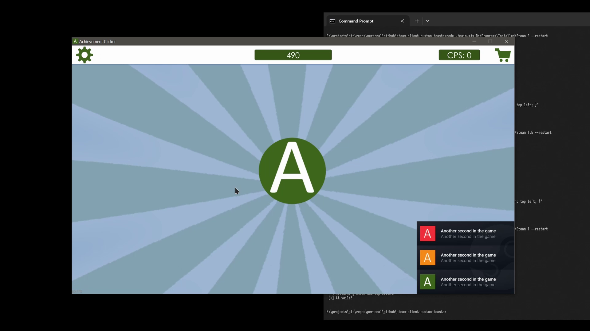
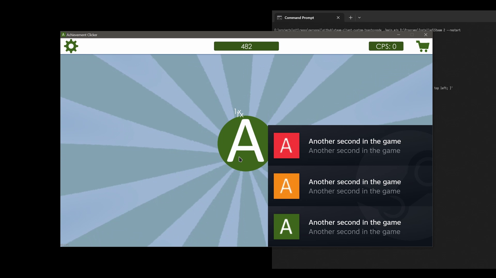

# Description

Once upon a time, in the far 2025, someone at the awesome /r/Steam Discord, raised a subject regarding the Steam desktop client [achievement](<https://partner.steamgames.com/doc/features/achievements>) notification sizes on the screen, yet at the time, we haven't found an explicit solution.

Evidently, as of `2025-10`, the official Steam client does not support an option to change the size of the overlay notification toasts.

Therefore, this is a quick, where proper CLI option library is missing, nor it is an actual plugin for [Millennium](<https://steambrew.app/plugins>)) at ths moment, but indeed an experimental workaround to change the sizes of notification toasts in Steam desktop client overlay.

We could only add the class and scale the DOM elements, but to this moment, it seems the current logic renders React components width definite sizes defined in the JavaScript file. Hence, the connection between the JavaScript and CSS.

The height and width of the Steam Overlay notification toast seems to be hardcoded, and hence we are trying to patch them in-file.

In attempt to not disturb the other user-interface logic and styles, we add a custom CSS class to the notification toast - `.lovely-custom-toasts`. The custom class is further to be used for custom CSS - scaling.

There's also DPI property passed within the logic (e.g. one of the `function Z()` that is used for toasts), but all the attempts to this moment affected other parts of the overlay, which is likely tied to the Window objects created.

# Preview

| Initial (x1) | Scaled x2 |
| ------------- | ------------- |
|  |   |

The title in the preview is [Achievement Clicker](<https://store.steampowered.com/app/743640>), and appreciate the developers/authors who made it possible to record a more proper preview!

# Dependencies

1. Node >=22 (just in case of future changes ^^);
2. Steam Client debugging enabled;

# Usage Examples

```bash
# Install dependencies
npm ci;

# Set toast size scale to x1.5
node ./main.js "${HOME}/.steam/steam/" 1.5;

# Set toast size scale to x2 and restart the client (requires CEF debugging enabled).
node ./main.js "${HOME}/.steam/steam/" 2 --restart;

# Reset to the original (same as scale 1).
node ./main.js "${HOME}/.steam/steam/";

# Inside the installation directory.
cd -- "${HOME}/.steam/steam/" &&
node '/path/to/main.js' ./ 1.8;

# In case of Windows OS
node ./main.js "C:\Program Files (x86)\Steam" 1.1;
```

> [!NOTE]
> After changes, the Steam desktop client JavaScript context must be restarted to likely reload the module, and if no automated option was selected (i.e. CLI option `--restart`), a manual client restart is required.
>
> Under-the-hood, the automation executes a built-in Steam client function within the debugging channel via [WebSockets](<https://developer.mozilla.org/en-US/docs/Web/API/WebSockets_API>): `SteamClient.Browser.RestartJSContext()`.

# Automated Restart

In order to automatically restart the Steam client, we utilize Steam client built-in debugging feature specifically designed for the client that is based on internal Chromium Embedded Framework (CEF) capabilities.

First of all, please familiarize with security, vulnerability, and responsibility of CEF and Node debugging, if you haven't yet.

> Since the debugger has full access to the Node.js execution environment, a malicious actor able to connect to this port may be able to execute arbitrary code on behalf of the Node.js process. It is important to understand the security implications of exposing the debugger port on public and private networks.
>
> If the debugger is bound to a public IP address, or to 0.0.0.0, any clients that can reach your IP address will be able to connect to the debugger without any restriction and will be able to run arbitrary code.
>
> By default `node --inspect` binds to `127.0.0.1`. You explicitly need to provide a public IP address or `0.0.0.0`, etc., if you intend to allow external connections to the debugger. Doing so may expose you to a potentially significant security threat. We suggest you ensure appropriate firewalls and access controls are in place to prevent a security exposure.
>
> [Source](<https://nodejs.org/en/learn/getting-started/debugging#security-implications>)

> [!CAUTION]
> In other words, even if magnificent projects as [Millennium](<https://github.com/SteamClientHomebrew/Millennium/blob/38506c919b3400244c06e2c8f832975b904748be/pkgbuild/millennium.install#L34>), [Decky](<https://github.com/SteamDeckHomebrew/decky-installer/blob/9b4e29d2a33b969da11114cce18422a87425f60e/cli/install_release.sh#L36>), [EmuDeck](<https://github.com/dragoonDorise/EmuDeck/blob/814623e5c9c21df0192515d666c318dedb5d9cf2/functions/ToolScripts/emuDeckPlugins.sh#L59>) etc. utilize the debugging features of the client, and while the Steam client binds to `127.0.0.1:8080`, leaving it enabled may imply __security issues__, since within the debugging context, all the Steam account session cookies are available, and not to mention access to host system (e.g. built-in JavaScript functions as `SteamClient.System.RestartPC()`).

1. Create file `.cef-enable-remote-debugging` in the Steam desktop client installation directory;
2. Restart the Steam client.

To disable the mode - delete the file before the next client restart.

# Complete Reset

In case of the script reset did not work properly (i.e. execution with the scale of 1).

1. Terminate the Steam desktop client;
2. Delete files in the Steam desktop client installation directory:

    1.1. `./steamui/chunk~2dcc5aaf7.js`;

    1.2. `./steamui/css/chunk~2dcc5aaf7.css`.

3. Launch the Steam desktop client (it should self-validate and reinstall the missing).